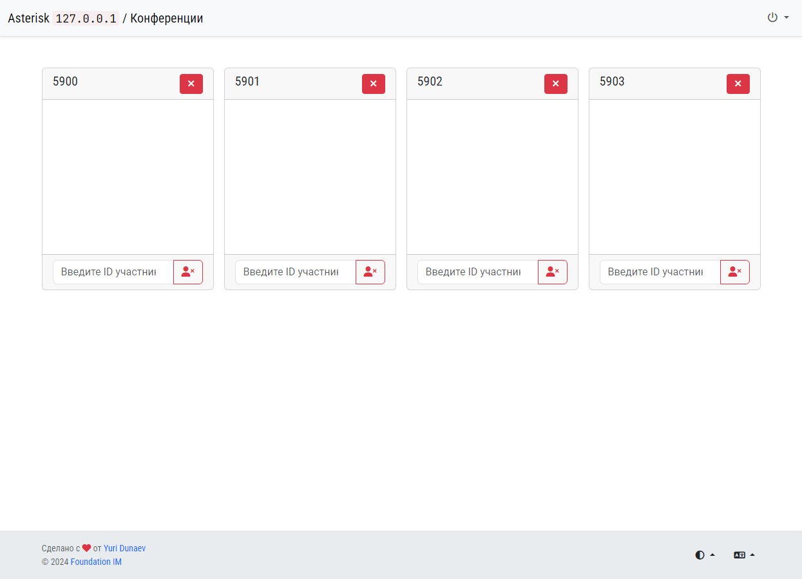
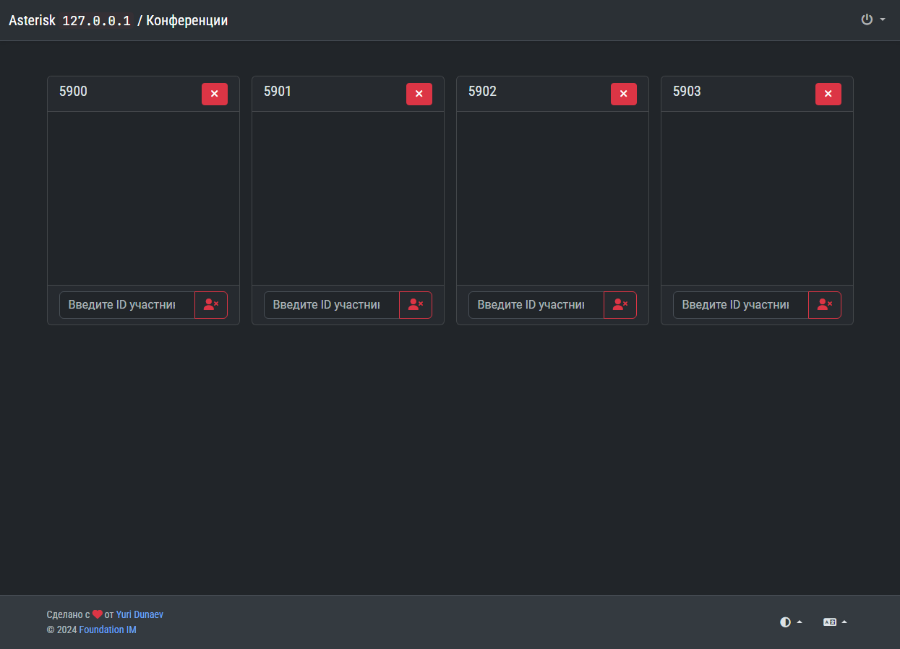

# Asterisk Rooms

Интерфейс для мониторинга конференц-комнат в **Asterisk**.

## Возможности

- Удаление всех пользователей из конференции.
- Удаление определённого пользователя из конференции.
- Поддержка светлого и тёмного интерфейсов.
- Поддержка интернационализации.

### Светлый режим

### Тёмный режим

## Особенности

Кнопки управления конференцией имеют блокировку в 5 секунд после нажатия. Это сделано для того, чтобы позволить Asterisk'у выполнить задачу и обновить у себя информацию по участникам конференции.

## Установка

1. Скопировать файлы в директорию на сервере.
2. Настроить **Apache** или **Nginx** на выполнение **PHP** в этой директории.
3. Закрыть доступ к директории паролем. В файле [`htaccess.txt`](htaccess.txt) находится пример конфигурации для Apache.
